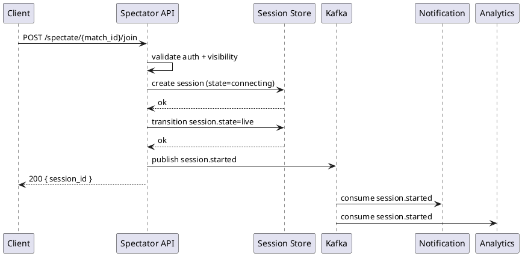

<!--
Architecture Template — canonical structure for `docs/architecture.md`

This template uses the **C4 model** (https://c4model.com) at levels 1-3:
  - C1 Context — system boundary + external actors + external systems
  - C2 Containers — deployable/runnable units (apps, services, databases, queues)
  - C3 Components — major structural building blocks INSIDE each container

C4 level 4 (Code) is owned by BE/FE Dev and is optional (kit does NOT mandate format
— see `.claude/agents/_templates/be-dev.md` + `fe-dev.md`).

This template serves two purposes:

1. **Reference for SA when authoring `docs/architecture.md`.** Copy this to the
   project; fill in the placeholders.
2. **Validation baseline.** Downstream agents (TL, BE/FE Dev, QA-Author) read this
   structure when consuming architecture decisions.

Diagrams use PlantUML with C4-PlantUML macros (https://github.com/plantuml-stdlib/C4-PlantUML).
This matches the kit's existing PlantUML usage in `frs-template.md` sequence diagrams.
See `.claude/skills/c4-author/SKILL.md` for the notation conventions + worked examples.

Replace this entire HTML comment block before publishing the architecture document.
-->

# Architecture — [Project Name]

- **Version:** 1.0
- **Status:** Draft <!-- Draft | Validated | Active | Superseded. SA authors at Draft; architecture-validator flips Draft->Validated (the gate that unblocks TL); Active once implementation starts; Superseded when replaced. -->
- **Author:** [SA name]
- **Validated-by:** <empty until architecture-validator qualifies; then `architecture-validator`>
- **Last-Updated:** <ISO-8601>
- **Linked SRS:** docs/SRS.md
- **C4 Model:** https://c4model.com (this document follows C1–C3; C4 Code is owned by BE/FE Dev per `be-dev.md` / `fe-dev.md`)

---

## 1. System Context (C1)

*The system's boundary. Who uses it (human roles); what external systems it integrates with; how data flows in and out at the highest level.*

[TODO: Replace the example diagram with the project's own. C1 is MANDATORY for every architecture doc — every system has a boundary.]

```plantuml
@startuml C1-Context
!include https://raw.githubusercontent.com/plantuml-stdlib/C4-PlantUML/master/C4_Context.puml

Person(viewer, "Spectator", "Watches live tournament matches")
Person(admin, "Tournament Admin", "Toggles match spectatability")

System(spectator, "Spectator Service", "Provides real-time match viewing for tournament audiences")

System_Ext(passport, "Account/Identity", "central identity provider (auth)")
System_Ext(matchHost, "Match Host", "Authoritative source of live match state")
System_Ext(kafka, "Kafka", "Org-wide event bus for analytics")

Rel(viewer, spectator, "Joins match, watches state stream")
Rel(admin, spectator, "Toggles match spectatability")
Rel(spectator, passport, "Validates session tokens")
Rel(spectator, matchHost, "Subscribes to match-state stream")
Rel(spectator, kafka, "Publishes SpectatorSession events")
@enduml
```

**External actors and systems table** (cite each by the same name used in the diagram):

| Name | Type | Interaction | Reference |
|---|---|---|---|
| Spectator | Person | Joins match via Spectate button; receives real-time state | SRS §5 role `viewer` |
| Tournament Admin | Person | Marks match spectatable | SRS §5 role `tournament-admin` |
| Account/Passport | External System | Provides session-token validation (in-org dependency) | `.claude/skills/solution-defaults/references/defaults-table.md` |
| Match Host | External System | Authoritative live-match state source | SRS §3.1 Domain Specification |
| Kafka | External System | Event bus (in-org dependency) | `solution-defaults` |

---

## 2. Containers (C2)

*Deployable / runnable units that make up the system. One row per container. C2 is MANDATORY for every architecture doc — every system has at least one container.*

[TODO: Replace the example diagram with the project's own.]

```plantuml
@startuml C2-Containers
!include https://raw.githubusercontent.com/plantuml-stdlib/C4-PlantUML/master/C4_Container.puml

Person(viewer, "Spectator")

System_Boundary(spectator_system, "Spectator Service") {
  Container(api, "Spectator API", "Node.js / Express", "Receives /spectate/{match_id}/join, validates session, manages MatchSpectatorSession lifecycle")
  Container(streamGateway, "Stream Gateway", "Node.js + Socket.IO", "Holds long-lived WebSocket connections to spectator clients; relays state from pub/sub")
  ContainerDb(sessionStore, "Session Store", "Redis", "MatchSpectatorSession rows, viewer counts, channel subscriptions")
  ContainerDb(matchVisibilityDB, "Match Visibility DB", "MySQL", "MatchPublicVisibility rows; admin-toggle state")
}

System_Ext(passport, "Account/Passport")
System_Ext(matchHost, "Match Host")
System_Ext(kafka, "Kafka")

Rel(viewer, api, "POST /spectate/{match_id}/join", "HTTPS")
Rel(viewer, streamGateway, "WebSocket connection", "WSS")
Rel(api, sessionStore, "CRUD sessions; pub/sub subscribe")
Rel(api, matchVisibilityDB, "Reads MatchPublicVisibility")
Rel(api, passport, "Validates session token")
Rel(streamGateway, sessionStore, "Subscribes to match-state.{match_id} channel")
Rel(matchHost, sessionStore, "Publishes match-state updates")
Rel(api, kafka, "Publishes SpectatorSessionStarted, SpectatorSessionEnded")
@enduml
```

**Containers table:**

| Container | Technology | Responsibility | Persistence |
|---|---|---|---|
| Spectator API | Node.js + Express | Session lifecycle, auth validation, visibility checks | Stateless |
| Stream Gateway | Node.js + Socket.IO | WebSocket fan-out from pub/sub channels | Stateless |
| Session Store | Redis Cluster | Live sessions, pub/sub channels, viewer counts | Persistent (RDB + AOF per `solution-defaults`) |
| Match Visibility DB | MySQL 8 | Admin-controlled match spectatability flags | Persistent |

**Cross-cutting concerns** (apply across containers; cite per-container variations when relevant):

- **Auth:** Account/Passport JWT validation at Spectator API; Stream Gateway delegates to API session check.
- **Observability:** Prometheus metrics + structured stdout logs per `solution-defaults`. Trace IDs propagate across containers.
- **Error handling:** Retry policy per ADR-NNNN (cite).
- **Rate limiting:** Spectator API enforces per-IP + per-account.
- **Secrets handling:** Environment-injected at container start; no secrets in deploy artifacts.

---

## 3. Components (C3)

*Major structural building blocks INSIDE each container. One C3 section per container that has more than one major component. Containers with a single major component MAY omit C3 (note explicitly: "C3 omitted: container is single-component"). Each component's row carries `Linked FRs` for traceability back to `docs/frs/<FR-ID>.md`.*

[TODO: One sub-section per non-trivial container. Replace examples with the project's own.]

### 3.1. Spectator API (C3)

```plantuml
@startuml C3-SpectatorAPI
!include https://raw.githubusercontent.com/plantuml-stdlib/C4-PlantUML/master/C4_Component.puml

Container_Boundary(api, "Spectator API") {
  Component(joinHandler, "Join Handler", "Express route", "POST /spectate/{match_id}/join; validates + creates session")
  Component(sessionManager, "Session Manager", "Domain service", "MatchSpectatorSession lifecycle: connecting → live → disconnected")
  Component(visibilityChecker, "Visibility Checker", "Domain service", "Resolves MatchPublicVisibility; applies regional rules (CN PIPL)")
  Component(authAdapter, "Auth Adapter", "Infrastructure", "Account/Passport session validation; caching")
  Component(eventEmitter, "Event Emitter", "Infrastructure", "Publishes domain events to Kafka")
}

ContainerDb(sessionStore, "Session Store")
ContainerDb(matchVisibilityDB, "Match Visibility DB")
System_Ext(passport, "Account/Passport")
System_Ext(kafka, "Kafka")

Rel(joinHandler, authAdapter, "Validate session token")
Rel(authAdapter, passport, "GET /sessions/validate")
Rel(joinHandler, visibilityChecker, "Check spectatable")
Rel(visibilityChecker, matchVisibilityDB, "Read MatchPublicVisibility")
Rel(joinHandler, sessionManager, "Create / reuse session")
Rel(sessionManager, sessionStore, "Persist + pub/sub subscribe")
Rel(sessionManager, eventEmitter, "On state transition")
Rel(eventEmitter, kafka, "Publish event")
@enduml
```

**Components table:**

| Component | Layer | Responsibility | Linked FRs |
|---|---|---|---|
| Join Handler | Interface | POST /spectate/{match_id}/join endpoint; orchestrates the flow | FR-001 |
| Session Manager | Domain | `MatchSpectatorSession` lifecycle; idempotency per `(account_id, match_id)` | FR-001, FR-002 |
| Visibility Checker | Domain | `MatchPublicVisibility` resolution + regional rules | FR-001, FR-004 |
| Auth Adapter | Infrastructure | Account/Passport session validation w/ short-TTL cache | FR-001 (auth precondition) |
| Event Emitter | Infrastructure | `SpectatorSessionStarted`, `SpectatorSessionEnded` to Kafka | FR-001, FR-002 |

### 3.2. Stream Gateway (C3)

*C3 omitted: container is single-component. The Stream Gateway is one Socket.IO server that subscribes to Redis pub/sub channels and forwards state to connected clients; no internal decomposition warrants a C3 diagram.*

### 3.3. Session Store (C3)

*C3 omitted: container is a managed datastore (Redis Cluster). Internal structure is the vendor's; not authored by the kit.*

### 3.4. Match Visibility DB (C3)

*C3 omitted: container is a managed datastore (MySQL). Schema is documented in `docs/SRS.md` §3.1 (Entities + Value Objects).*

---

### 3.5. Data Models

*Schema-level detail per major datastore container. SA design mode authors from SRS §3.1 Entities + Value Objects; extract mode populates from archaeology\'s Data Model table.*

[TODO: One sub-section per datastore container with substantive schema. Inline schemas; do NOT link to external DB tools as the source.]

#### 3.5.1. Match Visibility DB (MySQL)

| Entity | Field | Type | Constraints | Notes |
|---|---|---|---|---|
| MatchPublicVisibility | match_id | BIGINT | PK | references match service\'s match identifier |
| MatchPublicVisibility | is_spectatable | BOOLEAN | NOT NULL DEFAULT FALSE | gate-field; see §6 row |
| MatchPublicVisibility | regional_rules | JSON | NULL | per-region overrides (CN PIPL etc.) |
| MatchPublicVisibility | updated_at | DATETIME | NOT NULL | last write; see §6 if used as gate |
| MatchPublicVisibility | updated_by_task | VARCHAR(32) | NULL | audit; populated by writing task |

**Indexes:** `idx_spectatable (is_spectatable, updated_at)` for spectator-list queries.

**Foreign keys:** none cross-service (match_id is logical reference, not enforced FK).

**Invariants:**
- `is_spectatable = TRUE` requires `regional_rules` to be non-null when the match is in a region with PIPL/GDPR constraints.
- `updated_at` is monotonically non-decreasing per row.

#### 3.5.2. Session Store (Redis Cluster)

*Managed datastore — key schema only; no relational structure.*

| Key pattern | Value type | TTL | Notes |
|---|---|---|---|
| `session:{account_id}:{match_id}` | Hash {state, started_at, last_seen_at} | 4h sliding | spectator session lifecycle |
| `match:{match_id}:viewers` | Sorted set of account_id by last_seen_at | 4h | for live viewer count |
| `pubsub:match:{match_id}` | Channel | n/a | match-state broadcast |

**Persistence:** AOF every-second; cluster handles 50,000 keys/match without partitioning.

---

### 3.6. API Inventory

*Consolidated index of every API surface. Per-endpoint detail lives at `docs/api-contracts/<endpoint>.md` per SRS §3.4.4 contract format. SA design mode lists the endpoints implied by SRS §3.3 FRs; extract mode lists from archaeology and auto-authors stub contract files marked `Source: extracted | Status: Draft`.*

[TODO: One row per API surface. The contract-file path column is mandatory; the file may be Draft/Frozen/Extracted at SA's time-of-writing.]

| Method + path / RPC / event | Container | Auth | Contract file | Status | Linked FRs |
|---|---|---|---|---|---|
| POST /spectate/{match_id}/join | Spectator API | Bearer | docs/api-contracts/spectate-join.md | Frozen | FR-001 |
| GET /spectate/{match_id}/state | Spectator API | Bearer | docs/api-contracts/spectate-state.md | Frozen | FR-001, FR-002 |
| WebSocket /stream/{session_id} | Stream Gateway | session-token | docs/api-contracts/stream-ws.md | Frozen | FR-002 |
| Kafka topic: `match.spectator.session.started` | Spectator API → notification service | mTLS | docs/api-contracts/event-session-started.md | Frozen | FR-001 |
| Kafka topic: `match.spectator.session.ended` | Spectator API → notification service | mTLS | docs/api-contracts/event-session-ended.md | Frozen | FR-001 |

**Status legend.** `Draft` (BE Dev authoring; not yet ready for FE consumption), `Frozen` (FE Dev may consume per CLAUDE.md §10 hard rule), `Extracted` (SA `extract` mode created stub; needs human confirmation per brownfield Stage 4 before BE Dev finalizes).

---

### 3.7. Dependency & Call Graph

*Per-container internal package/module dependency tree AND cross-container call graph. The C2/C3 PlantUML diagrams show component relations via `Rel(...)` lines; this section consolidates them into a focused view + adds internal-module structure that the higher-level diagrams omit.*

[TODO: One sub-section per non-trivial container. For containers with simple internal structure, note "single-package / no internal graph."]

#### 3.7.1. Cross-container call graph

```plantuml
@startuml CrossContainerGraph
\'! C4-Container-style minus the boundaries; pure dependency arrows
[Spectator API] --> [Account/Passport] : validate session
[Spectator API] --> [Match Visibility DB] : visibility lookup
[Spectator API] --> [Session Store] : session persist
[Spectator API] --> [Kafka] : domain events
[Stream Gateway] --> [Session Store] : pub/sub subscribe
[Stream Gateway] --> [Match State Service] : initial state fetch
@enduml
```

Each edge is one of: synchronous call (HTTP/gRPC), async event (Kafka/queue), data dependency (read/write to shared datastore).

#### 3.7.2. Internal module dependencies — Spectator API

| From package | To package | Type | Notes |
|---|---|---|---|
| handlers | services | sync call | Join handler → SessionManager |
| services | repositories | sync call | SessionManager → SessionStoreRepo |
| services | events | sync call | SessionManager → EventEmitter |
| repositories | infrastructure/redis | sync call | SessionStoreRepo → Redis client |
| events | infrastructure/kafka | sync call | EventEmitter → Kafka producer |
| infrastructure/* | (no internal upward refs) | — | clean-architecture boundary |

**External-library production dependencies** (SA extract mode populates from `package.json` / `go.mod` / `Cargo.toml` / `requirements.txt` etc.):

| Package | Version | Purpose | Risk |
|---|---|---|---|
| express | 4.18.x | HTTP framework | low — well-maintained |
| ioredis | 5.x | Redis client | low |
| kafkajs | 2.x | Kafka producer | low |
| jsonwebtoken | 9.x | session token validation | medium — security-critical; pin patch version |

---

### 3.8. Async Workflows

*One sub-section per async flow — event chains where the producer and consumer are decoupled by a queue or topic. SA design mode authors from SRS FR Sequence Diagrams and cross-component event flows; extract mode authors from archaeology\'s Domain Events Observed.*

[TODO: One sub-section per non-trivial async flow. Skip single-hop request/response flows — those belong in C3.]

#### 3.8.1. Spectator session lifecycle events

**Trigger:** POST /spectate/{match_id}/join (Spectator API receives client request).
**Producer:** Spectator API → Event Emitter component.
**Topic:** `match.spectator.session.started` (Kafka).
**Consumers:** notification-service (account_id email/push), analytics-service (real-time viewer-count gauges), audit-service (compliance log).
**State transitions:** `Session: not-exist → connecting → live`. The `live` transition fires the `session.started` event.



**Retry / DLQ policy.** Kafka producer uses idempotent writes (no duplicate events). Consumers commit offsets after processing; DLQ `match.spectator.session.started.dlq` collects consumer failures after 3 retries with exponential backoff. Producer-side retries on Kafka unavailability are §5 retry-classification `transient`.

**Failure modes** (cross-reference §5): producer-side Kafka unavailability → session.started event eventually-consistent (3-5s gap); consumer-side processing failure → consumer commits to DLQ, session remains live (event-loss-tolerant: viewer-count gauges may undercount for the affected session until DLQ drain).

#### 3.8.2. Session-ended cleanup chain

[TODO if applicable: same structure as 3.8.1 — Trigger / Producer / Topic / Consumers / Sequence diagram / Retry policy / Failure modes.]

---

## 4. Non-Functional Posture

*Quantitative targets traceable to SRS §4 NRS. Reference each NRS item by ID (NFR-NNN) when one exists.*

[TODO: One row per binding NRS commitment.]

| NRS area | Target | Source | Where enforced (container / component) |
|---|---|---|---|
| Match-state latency P95 | < 1000ms | SRS NFR-001 | Stream Gateway + Session Store pub/sub path |
| Concurrent spectators per match | 50,000 | SRS NFR-002 | Stream Gateway horizontal scale + Redis Cluster capacity |
| Spectator API uptime in tournament window | 99.5% | SRS NFR-003 | Spectator API (load-balanced; multi-region for CN) |
| Pub/sub degradation fallback | 5s polling | SRS NFR-006 | Stream Gateway switches to poll when channel heartbeat stalls |

---

## 5. Failure Modes

*What fails, how it's detected, how it recovers. One row per material failure path. **Every failure mode that involves a retry policy declares its classification — deterministic vs transient — so retry logic (DAL, HTTP clients, queue producers) doesn't waste retries on errors that will fail identically every time.***

**Retry classification matrix** (mandatory when the architecture has any retry policy):

| Error class | Classification | Examples | Retry behavior |
|---|---|---|---|
| **Transient** — same input may succeed on retry | retryable | Connection drop, timeout, 5xx with `Retry-After`, deadlock, queue throttling | Exponential backoff per ADR-NNNN; max N retries |
| **Deterministic** — same input always fails the same way | do-not-retry | Format violations (bad datetime / UUID / encoding), constraint violations (FK / unique / NOT NULL), syntax errors, 4xx other than 429, schema-validation failures | Surface immediately; log full driver/HTTP error; escalate to operator. NO retries. |
| **Ambiguous** | requires-classifier | 503 without `Retry-After`, application-level errors | Classifier function decides per error code/message; default conservative = do-not-retry |

Per-flow failure rows below cross-reference this classification.

[TODO: One row per failure mode that's load-bearing or might surface in a runbook. For failure modes involving retry, name the classification.]

| Failure | Classification | Detection | Recovery | ADR ref |
|---|---|---|---|---|
| Redis Cluster node loss | Health-check + replication lag metric | Failover to replica; degrade Stream Gateway to polling | ADR-0012 |
| Account/Passport unavailable | Auth Adapter retry-budget exhausted | Spectator API returns 503 with `Retry-After`; Stream Gateway disconnects clients gracefully | ADR-0011 |
| Match Host stops publishing | Channel heartbeat timeout (30s) | Session Manager transitions sessions to `disconnected`; emits `WorkerCrashed`-equivalent event | — |

---

## 6. Cross-Component Data Contracts

*Required when the data model has any **gate field** — a column written by one component and read by another to gate behavior (skip logic, state-machine transitions, eligibility filters, idempotency / dedup, version checks, ownership / authorization). When the data model has no such columns, write `N/A — no gate fields identified` with a one-line rationale. See [`.claude/skills/data-lifecycle-contracts/SKILL.md`](../../skills/data-lifecycle-contracts/) for the detection heuristic, common patterns, and authoring procedure.*

*Why this section exists. Column-level write ownership sits between C3 (component responsibilities) and C4 (code-level columns) — neither layer documents it. Without it, BE Dev / FE Dev defaults to ORM-convenience patterns (stamp `updated_at` on every upsert), silently breaking downstream gates that read the same column. The Agent Generator extracts this table into BE Dev / FE Dev `## Project Specialization` as explicit write-prohibition constraints; Code Reviewer's lens-driven review checks §6 compliance.*

[TODO: Populate when applicable. One row per gate field. Apply the data-lifecycle-contracts skill's detection heuristic.]

| Column | Owner(s) | Write condition | Consumers (Readers) | Gate semantics | Other-writer constraint |
|---|---|---|---|---|---|
| `<schema.column>` | `<Component / Task>` | `<when this writer stamps>` | `<who reads it + how>` | `<what the read controls>` | `<what other services MUST NOT do>` |

### Format boundaries

*Required when data flows across two systems with different format specs for the same conceptual type (datetime variants, UUID encoding, monetary precision, encoding, etc.). Apply the detection heuristic from [`.claude/skills/format-boundary-contracts/SKILL.md`](../../skills/format-boundary-contracts/SKILL.md). When the data flow has no format mismatch, write `N/A — all flows preserve format` with a one-line rationale.*

| Field | Source format | Destination format | Boundary owner | Transformation | Failure mode |
|---|---|---|---|---|---|
| `<field>` | `<exact format spec at origin>` | `<exact format spec at destination>` | `<Component / Task responsible>` | `<the conversion function / step>` | `<deterministic — do-not-retry OR transient — retryable>` |

<!-- EXAMPLE — GitLab → MySQL datetime boundary (the merged_at bug)

| Field | Source format | Destination format | Boundary owner | Transformation | Failure mode |
|---|---|---|---|---|---|
| `merged_at` | GitLab ISO-8601 with `T` separator + `Z` suffix (`"2025-06-15T14:30:00Z"`); always UTC | MySQL `DATETIME` `'YYYY-MM-DD HH:MM:SS'`; zone-less binary format; per-connection `time_zone='+07:00'` controls interpretation NOT bound-parameter format | MR Collection Service (T-013) | `gitLabIsoToMysqlDatetime(s)` — `s.replace('T', ' ').replace('Z', '')`; verifies `/^\d{4}-\d{2}-\d{2} \d{2}:\d{2}:\d{2}$/`; throws `FormatError` on malformed input | **Deterministic** — DO NOT RETRY. Malformed datetime indicates either GitLab API change (escalate) or our own input error; retrying wastes 5 connections and hides the real failure. DAL retry-classification (§5) MUST classify MySQL `Incorrect datetime value` as `do-not-retry`. |
| `created_at`, `started_at` | Same as `merged_at` | Same | Same component | Same function | Same |

EXAMPLE -->


<!-- EXAMPLE — repository-sync gate field (T-011 bug case)

| Column | Owner(s) | Write condition | Consumers (Readers) | Gate semantics | Other-writer constraint |
|---|---|---|---|---|---|
| `repositories.last_synced_at` | Branch Detection (T-012), MR Collection (T-013) | AFTER successful per-repo data collection — all of FR-002 (branch detection succeeded), FR-003 (MR collection succeeded), FR-004 (commit collection succeeded), FR-005 (scoring succeeded) complete without error | WorkerPool skip check (per FR-006 Main Flow step 4) | `now - last_synced_at < SYNC_MIN_INTERVAL_MS → skip this repo for the current run` | Repository Sync Service (T-011, FR-001) MUST NOT stamp `last_synced_at` during discovery / upsert. T-011 only writes structural metadata: `name`, `path_with_namespace`, `gitlab_group_id`, `is_active`. ORM-convenience patterns (stamping `updated_at` on every upsert) MUST NOT apply to this column. |
| `repositories.is_active` | Repository Sync Service (T-011) | When project not found in GitLab discovery (set false) OR re-discovered after absence (set true) | WorkerPool eligibility filter (FR-006 Main Flow step 3); analytics queries | `is_active = false → skip from current run` | Branch Detection (T-012), MR Collection (T-013) MUST NOT toggle `is_active`. Discovery owns active / inactive lifecycle. |
| `collection_runs.status` | Worker pool (T-006 driver) | At run start (`running`), each batch checkpoint (`running` heartbeat refresh), run end (`completed`, `partial`, `failed`) | Health-check API (FR-011); admin dashboard; crash-detection job | `status = running AND now - last_heartbeat > 5min → mark crashed (FR-006 WorkerCrashed event)` | Per-repo task workers (T-011 / T-012 / T-013) MUST NOT mutate `collection_runs.status` directly. Pool owns the run lifecycle; per-repo failures aggregate via event emission, not direct column writes. |

EXAMPLE -->

---

## 7. Open Architectural Risks

*Linked to entries in `docs/open-issues.md`. Don't restate the issue here; cite by ID + summary line.*

[TODO: Empty for clean architectures; populated when SA surfaces gaps during design or extract.]

| Issue | Summary | State |
|---|---|---|
| ISSUE-007 | Stream Gateway has no idempotency on duplicate join from same client | open |

---

## 8. Decision Records

*ADRs at `docs/decisions/` capture each non-trivial choice. List them here by ID with a one-line title; full content lives in the per-ADR files per `.claude/skills/adr-author/`.*

[TODO: One row per ADR that shapes the architecture.]

| ADR | Title | Status |
|---|---|---|
| ADR-0011 | Use Account/Passport for spectator auth (org default) | Accepted |
| ADR-0012 | Use Redis Cluster for live-match pub/sub state | Accepted |
| ADR-0013 | Spectator API endpoint contract Frozen at v1.0 | Accepted |

---

## 9. Changelog

*Append-only. Major architecture changes (new container, removed container, NRS posture shift) revert SRS per `.claude/rules/change-synchronization.md` §7.*

| Date | Change | By |
|---|---|---|
| <ISO-8601> | Initial architecture v1.0 — C1 + C2 + C3 (Spectator API) | SA |
