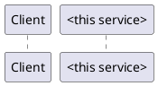
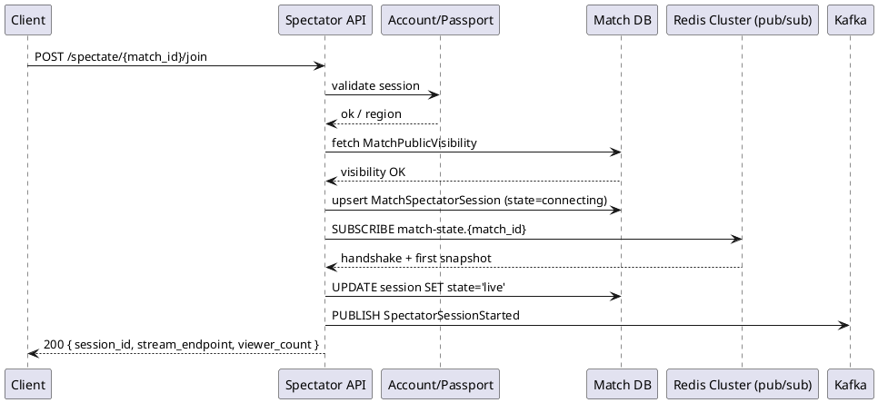

<!--
Per-FR detail template — canonical structure for `docs/frs/<FR-ID>.md`

This file lives in the SRS's companion folder. SRS §3.3 holds the index
(one-row-per-FR table); each row points here for full detail.

Two purposes:

1. **Reference for authors.** Copy this to `docs/frs/FR-NNN.md` and fill in.
2. **Validation baseline for BA's Phase 1.** BA verifies each FR-ID in SRS §3.3
   has a corresponding file at `docs/frs/<FR-ID>.md` with all required sections
   present.

Required sections (validated by BA):
- Description, Preconditions, Main Flow, Business Rules
- Input Schema, Output Schema, Error Handling
- Sequence Diagram (PlantUML)

Replace this HTML comment block before publishing the FR.
-->

# FR-NNN: <Title>

- **Status:** Draft <!-- Draft | Active | Deprecated -->
- **Priority:** P0 (MVP) <!-- P0 (MVP) | P1 | P2 -->
- **User Story:** US-NNN <!-- the SRS §3.2 User Story this FR implements -->
- **Last-Updated:** <ISO-8601>
- **Linked SRS:** docs/SRS.md §3.3 FRS index row for this FR
- **Linked Component:** <C3 component name from docs/architecture.md §3.x where this FR's operation lives; or `n/a` for cross-cutting FRs that don't map to a single component>

## Description

[TODO: 1–3 sentences. What the function does, viewed from the system boundary. Not the implementation, the behavior.]

<!-- EXAMPLE
Establish a live pub/sub session for a spectator joining an in-progress tournament match. Returns a stream endpoint the client connects to and the initial match-state snapshot.
EXAMPLE -->

## Preconditions

[TODO: What must be true before this function can execute. Reference Bounded-Context state machines if applicable.]

<!-- EXAMPLE
- Match exists in `in-progress` state
- Match is publicly spectatable (within tournament window + admin toggle on)
- Spectator has a valid Account/Passport session (always required in CN region; optional outside CN per OQ-8.1 resolution)
EXAMPLE -->

## Main Flow (Steps)

[TODO: Numbered steps from input to output. Each step is one action by one actor. Reference Aggregate Root methods where applicable (per SRS §3.1 DDD).]

<!-- EXAMPLE
1. Validate `match_id` and fetch `MatchPublicVisibility` from the Match DB.
2. Validate Account/Passport session token (or anonymous identity if permitted by region).
3. Check existing `MatchSpectatorSession` for this `(account_id, match_id)` pair; reuse if present and `state=live`.
4. Create new session row (state `connecting`); subscribe to Redis pub/sub channel `match-state.{match_id}`.
5. On first heartbeat from the channel, transition session to `live`; emit `SpectatorSessionStarted` to Kafka.
6. Return stream endpoint + session ID + initial state snapshot to the client.
EXAMPLE -->

## Business Rules (Invariants)

[TODO: Numbered or bulleted invariants. Each rule is testable in isolation. Cite SRS §3.1 Bounded Context invariants where applicable.

For rules whose test shape isn't obvious from the rule statement alone, add an optional `Test:` sub-field in Given/When/Then form. The `Test:` sub-field is OPTIONAL — pure mathematical invariants may not need it. RECOMMENDED for action-triggered rules. If the rule's test shape is fully covered by an Acceptance Scenario below, cite that scenario instead of duplicating.]

<!-- EXAMPLE
- **Rule 1:** Max concurrent `MatchSpectatorSession` per `(account_id, match_id)` is 1; a duplicate join request reuses the existing session.
- **Rule 2:** A session can only enter `live` state after a successful pub/sub subscription handshake.
- **Rule 3:** Anonymous spectating is forbidden in CN region (per SRS §4.1.7 Regional).
- **Rule 4:** Session moves to `disconnected` after 30 seconds without client heartbeat.
- **Rule 5:** `SpectatorSessionStarted` event MUST include `region`, `account_id` (or `anonymous`), `match_id`, `timestamp`.
EXAMPLE -->

## Acceptance Scenarios

[MANDATORY: At least one happy-path scenario per FR. Add alternate paths + negative cases (negatives REQUIRED when the FR involves auth, payments, external integrations, retries, or background jobs). Each scenario is in Given/When/Then form so it translates 1:1 into a QA-Author test case at `docs/test-cases/by-task/<task-id>/api.md` (or `by-us/<US-ID>/` for behavioral coverage). The cross-consistency check at BA Phase 2 sign-off verifies every scenario aligns with the Main Flow + Business Rules above.]

### Scenario 1: [Happy path title]

- **Given** [preconditions — system state, auth, prior data]
- **When** [request shape — method + path + payload, OR event trigger]
- **Then** [observable outcome — status code, response body shape, side effects on persistent state, events emitted]

<!-- EXAMPLE — FR-001 Spectator join endpoint

### Scenario 1: Happy path — successful join returns 200 with session details

- **Given** match `M-T-001` exists with `state=in-progress` AND `is_public=true`
  AND the caller's Account/Passport session is valid
- **When** the caller sends `POST /api/v1/spectate/M-T-001/join` with `{ "account_id": "<uuidv7>", "client_meta": { "region":"VN", "platform":"web" } }`
- **Then** the response is 200 with body matching:
  ```json
  { "session_id":"<uuidv7>", "stream_endpoint":"wss://...", "viewer_count":<integer>, "initial_state":{...} }
  ```
  AND a row in `MatchSpectatorSession` table exists with the returned `session_id` and `state=live`
  AND a `SpectatorSessionStarted` event is observable on the Kafka `spectator-events` topic within 1 second

### Scenario 2: Match does not exist returns 404

- **Given** no match exists with id `M-T-999`
  AND the caller's session is valid
- **When** the caller sends `POST /api/v1/spectate/M-T-999/join`
- **Then** the response is 404 with body `{ "error": "ERR_MATCH_NOT_FOUND" }`
  AND no `MatchSpectatorSession` row is created
  AND no Kafka event is published

### Scenario 3: Anonymous request in CN region returns 401 (negative)

- **Given** the request originates from CN region (per `client_meta.region` or geo-IP)
  AND no `Authorization` header is present
- **When** the caller sends `POST /api/v1/spectate/M-T-001/join`
- **Then** the response is 401 with body `{ "error": "ERR_AUTH_REQUIRED_REGIONAL" }`
  AND no `MatchSpectatorSession` row is created

EXAMPLE -->

## Input Schema (JSON / Proto)

[TODO: Exact request shape. Include field types, required/optional, constraints. Inline or reference an existing schema file.]

<!-- EXAMPLE

```json
{
  "match_id": "string (UUIDv7, required)",
  "client_meta": {
    "region": "string (enum: VN|CN|EU|US|...)",
    "platform": "string (enum: web|ios|android)",
    "client_version": "string (semver)"
  }
}
```

Auth: `Authorization: Bearer <Account/Passport JWT>` header; optional in non-CN regions per region policy.

EXAMPLE -->

## Output / Response Schema

[TODO: Exact response shape per status code.]

<!-- EXAMPLE

### 200 OK — session live

```json
{
  "session_id": "string (UUIDv7)",
  "stream_endpoint": "string (WebSocket URL)",
  "viewer_count": "integer",
  "initial_state": {
    "match_state": "object (MatchStateSnapshot per Value Object spec)",
    "timestamp": "string (ISO-8601)"
  }
}
```

### 200 OK — existing session reused

Same shape as fresh session; `session_id` matches the existing session's ID.

EXAMPLE -->

## Error Handling

[TODO: Table of error conditions → error code → HTTP status. Match SRS §3.4 project-wide error envelope if one exists.]

<!-- EXAMPLE

| Condition | Error Code | HTTP Status |
|---|---|---|
| Match does not exist | `ERR_MATCH_NOT_FOUND` | 404 |
| Match not spectatable (window closed / admin toggle off) | `ERR_MATCH_NOT_SPECTATABLE` | 403 |
| Anonymous request in CN region | `ERR_AUTH_REQUIRED_REGIONAL` | 401 |
| Account/Passport session invalid or expired | `ERR_UNAUTHORIZED` | 401 |
| Rate limit exceeded | `ERR_RATE_LIMITED` | 429 |
| Pub/sub subscription failure (Redis down) | `ERR_STREAM_UNAVAILABLE` | 503 |

EXAMPLE -->

## Sequence Diagram

[TODO: PlantUML sequence diagram showing the interaction across actors (client, this service, internal services, external dependencies).]



<!-- EXAMPLE



EXAMPLE -->

## Data Effects

*Required when this FR writes to the data model. List every column this FR writes + the condition. For any column declared as a gate field in [architecture.md §6 Cross-Component Data Contracts](../../../docs/architecture.md), explicitly cite the §6 row — this makes the write contract visible at FR-level for QA-Author + Code Reviewer.*

[TODO: List per-column writes. Omit the sub-section if the FR is read-only / pure query.]

| Column | Write condition | Gate field (see §6)? |
|---|---|---|
| `<schema.column>` | `<exact condition under which this FR writes>` | `<yes — §6 row N | no>` |

<!-- EXAMPLE — FR-003 MR Collection (writes last_synced_at as a §6 gate field)

| Column | Write condition | Gate field (see §6)? |
|---|---|---|
| `merge_requests.*` | On each MR fetched from GitLab API | no |
| `commits.*` | On each commit within a fetched MR | no |
| `repositories.last_synced_at` | AFTER all MR + commit fetches for THIS repo complete without error | **yes** — §6 row 1; this FR is one of the two declared owners (alongside FR-002 Branch Detection). Write condition matches §6 row 1 exactly: "AFTER successful per-repo data collection." |
| `collection_runs.status` | NOT WRITTEN — §6 row 3 reserves this for the Worker pool (T-006) | n/a |

EXAMPLE -->

## Linked artifacts

[TODO: Cross-references to other docs as they become available.]

<!-- EXAMPLE
- API contract: `docs/api-contracts/spectator-join.md` (Status: Frozen as of ADR-0013)
- Test cases: `docs/test-cases/by-task/T-014/api.md` (when QA-Author lands task-scoped cases)
- ADRs touching this FR: ADR-0012 (Redis Cluster), ADR-0013 (Spectator API contract)
- Master-plan tasks implementing this FR: T-014 (BE — endpoint), T-015 (FE — UI integration)
EXAMPLE -->

## Notes

[Free-form: design rationale, alternatives considered for this FR specifically, edge cases worth flagging. Not for invariants — those go in Business Rules.]

## Deprecation Note

[Empty for active FRs. When the FR is deprecated by a later SRS version, BA's Phase 4 sets `Status: Deprecated` in the frontmatter AND fills this section with: (1) which SRS version deprecated it, (2) why, (3) what replaced it (if anything), (4) what happened to the API contract (`docs/api-contracts/<endpoint>.md`) — typically transitions to `Status: Deprecated` and the endpoint is scheduled for removal via a cleanup task.]

<!-- EXAMPLE
- Deprecated-In: v1.1
- Reason: Endpoint removed per US-014 deprecation (no consumers remain).
- Replacement: N/A; in-stream ad uses a different contract (FR-027).
- API contract: `docs/api-contracts/ads-preroll.md` marked Status: Deprecated. Cleanup task T-040 will remove the endpoint and revoke client credentials.
EXAMPLE -->
